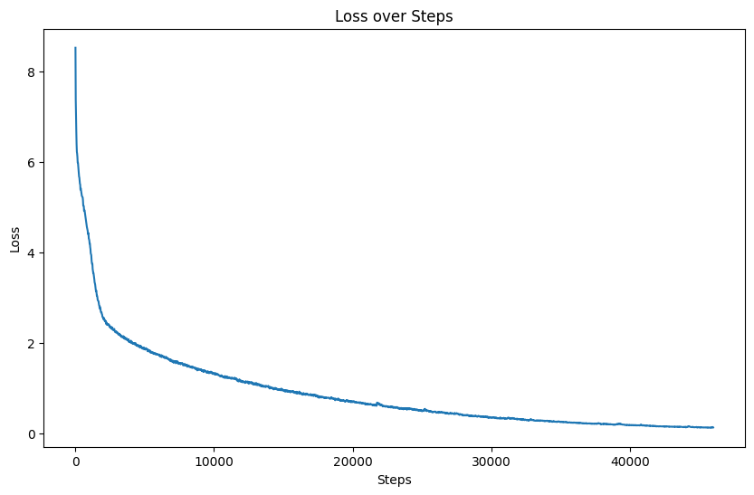
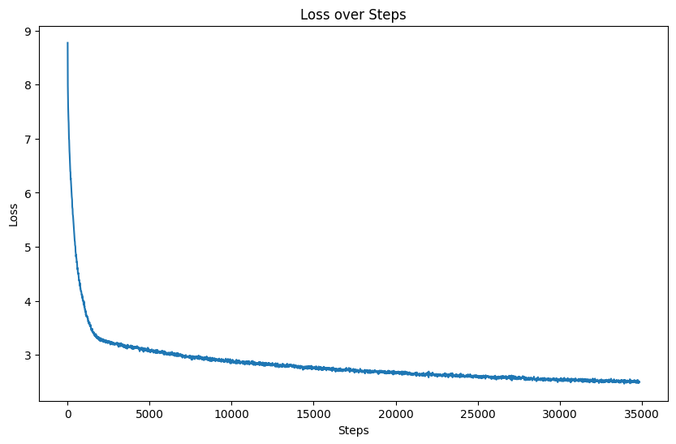

# MyLLM: My Large Language Model in action

记录一下动手边做边学Large Language Model的过程。不要当一个调包侠，要知道细节，以及为什么这么做。

## TODO List

### ✅ 已完成

- [x] [2025.2.11] 训练一个分词器

- [x] [2025.2.13] 参考minimind复现大模型预训练，并参考qwen2和llama将实现迁移到HF的Transformers规范

- [x] [2025.2.15] 改进Attention机制以及引入MoE
  - [x] [2025.2.15] SDPA支持
    - [x] SDPA模型训练中，同样batch峰值显存消耗与训练时间下降了一半，增加batch
  - [ ] ~~FlashAttention支持~~(暂时搁置，SDPA也挺快的)
  - [x] 基础MoE与专家负载均衡训练
    - [x] FFN MoE

- [x] [2025.2.20] Generation相关
  - [x] use_cache支持：支持DynamicCache

### 🕥 进行中

- [ ] [2025.3.2] 训练
  - [ ] SDPA训练结果不太理想，估计是OneCycle调度器的问题，试试看修改一下重新训练
  - [ ] 训练MoE模型

- [ ] [2025.3.2] 改进Attention机制以及引入MoE
  - [ ] 基础MoE与专家负载均衡训练
    - [ ] Kimi Mixture of Block Attention
      - Kimi MoBA具体实现方式是什么？会不会影响KVCache？
      - 切分QKV的时候能不能用一个低秩矩阵计算Q分块和K分块的相关值？
      - 能不能逐层对原序列长度进行缩减？让模型把一段内容读薄？

- [ ] [2025.3.2] 做数据做数据！！！！：
  - [ ] 清洗预训练数据
  - [ ] 找点免费的api，根据种子合成领域迁移数据以及短CoT数据，执行全量微调

- [ ] 测试模型

### 🗓 计划内

- [ ] SFT：领域迁移全量微调、LoRA微调
- [ ] 强化学习与蒸馏
  - [ ] 由模型生成Policy，再利用Deepseek R1进行评分？
- [ ] 如何实现长文本输入？如何实现长文本的大海捞针？RoPE有没有必要更平滑？
- [ ] 手动配置DeepSpeed分布式计算，因为现在的运行方法在`io_operation`存在问题
  - [ ] 是否需要自定义Trainer（自定义DeepSpeed分布式训练）？
- [ ] 对MoE、Attention进行花式修改
  - [ ] 稀疏注意力与线性注意力
  - [ ] Deepseek V3的MLA和MoE
- [ ] ...

### 更新日志

- [2025.2.13]
完成Tokenizer训练，Debug跑通基础模型

- [2025.2.15]
修复PretrainDataset在生成labels时会比input_ids多一个的问题，增加对SDPA实现的FlashAttention支持

## 🧑‍💻 QA

1. 怎么让token的embedding在某种语义环境下呈现出特定的可加性呢？比如：

    - 迷你版的番茄是圣女果：Vector[迷你版的] + Vector[番茄] = Vector[圣女果] ≠ Vector[奇异果]
    - 也就是说，不能仅仅将向量表示学习局限于共现性约束

2. Debug中发现，由`GenerationMixin`生成的`position_ids`中，`attention_mask == 0`的部分全为1，这个目的是什么？

3. [2025.2.15] Padding token的嵌入应该随着模型的更新而更新吗？

   [2025.2.16] 看了一下Qwen2ForCausalLM的embed_tokens对应的padding嵌入，并不为0向量

4. [2025.2.15] 直接修改eager_attn为sdpa在训练过程中出现了nan值

   1. [2025.2.16] 原来写的`attention_mask(bsz, n, seq_len, seq_len)`，在`padding`的行全为`mask`，这个使得在计算`softmax`出现除0，参照Qwen2的处理方式，如果前k个`token`是`padding`，那么`attention mask`对应的`[k, seq_len]`全为0，而不是最小值填充，以规避上述情况。
   2. [2025.2.16] 解决上述问题后，Forward Passing没有再出现Nan，而Backward引发了Nan，在把`MyLLMRMSNorm`去掉的情况下不会出现Nan，问题还在排查。
   3. [2025.2.19] Backward的Nan问题已解决，在Debug过程中，使用了Qwen2的模型文件进行逐个模块替换，最后将问题定位在`nn.Embedding(..., padding_idx=0)`参数设置上，该设置使得在`MyLLMForCausalLM`的`lm_head`在反向传播时`grad_output`（该参数通过backward钩子函数获得）出现了Nan，把这个参数去掉就好了，但是作用机理仍不明。模块替换实验参考：[modeling_qwen.py](./test/modeling_qwen.py)

## 1. Tokenizer

使用BPE算法进行分词，参照[Minimind](https://github.com/jingyaogong/minimind)分词器的训练.

**使用数据**:

1. [Minimind](https://github.com/jingyaogong/minimind)分词器训练语料

2. [IndustryCorpus 2.0](https://data.baai.ac.cn/details/BAAI-IndustryCorpus-v2)的编程、人工智能-机器学习部分

**数据处理**:

- 核心步骤：

    1. 直接训练Tokenizer
    2. 检查Merges合并规则，人工提取不合理的合并规则
    3. 将连续符号使用正则表达式进行替换

- 参考： [0-tokenizer.ipynb](./notebooks/0-tokenizer.ipynb)

**其他参考资料**：

[Huggingface NLP Course - 6.🤗TOKENIZERS库](https://huggingface.co/learn/nlp-course/zh-CN/chapter6/1?fw=pt)

### **1.2 NOTES:**

#### [2025.2.11]

1. 在不进行原始数据清洗的情况下进行分词器训练会出现很多的连`空格`格和`=`等符号

2. 分词器解码在特殊token后会自动附加空格，这个bug目前还没解决

## 2. Pre-Train

参照[Qwen2](https://github.com/huggingface/transformers/blob/main/src/transformers/models/qwen2/modeling_qwen2.py)实现模型主要架构，参照[LLAMA](https://github.com/huggingface/transformers/blob/main/src/transformers/models/llama/modeling_llama.py)实现Eager GQA，参照[Qwen2](https://github.com/huggingface/transformers/blob/main/src/transformers/models/qwen2/modeling_qwen2.py)实现SDPA，参照[十分钟读懂旋转编码（RoPE）](https://zhuanlan.zhihu.com/p/647109286)实现旋转位置编码。

**使用数据:**

**数据处理:**

- 核心步骤（试了一下预处理速度太慢，目前训练速度也太慢了，所以先做模型结构去了）：

    1. 计算文本hash值，对重复部分进行再hash
    2. 对再hash重复部分检查其是否相同，相同则删除
    3. 对超长部分文本进行分段

- 参考： [1-pretrain.ipynb](notebooks/1-pretrain.ipynb)

### **2.2 NOTES:**

#### [2025.2.15]

**①** 基础实验已跑通，6卡训练耗时约41小时，Loss如图：

  

**②** Debug Qwen2模型推理过程，对模型文件进行修改，增加对SDPA的支持

1. 关注GenerationMixin做的n件事
   1. 生成position_ids和cache_position等
      - position_ids：在GenerationMixin.prepare_inputs_for_generation里被生成，由attention_mask前向累加得到，并在模型计算rotary_embedding时使用
      - cache_position：在GenerationMixin._get_initial_cache_position里被生成，并被past_key_values_length截断，在模型生成causal_mask和记录静态Cache时被使用

   2. 初始化Cache实例

      - 检查是否有传入的Cache实例
      - 检查模型支持的Cache类型
      - 没有支持类型时检查是否支持动态Cache类型

   3. 将准备好的参数传入生成方法，由生成方法调用模型的`forward`方法

      `GenerationMixin`集成了多种采样方法，如`GreedySearch`，`BeamSearch`以及`Sample`等；

2. Flash Attention

   - 参考资料

    [Bilibili: Flash Attention 为什么那么快？原理讲解](https://www.bilibili.com/video/BV1UT421k7rA)

    [Bilibili: 【7】Flash Attention 原理讲解](https://www.bilibili.com/video/BV17CPkeEEHH)

   - 训练日志（基于SDPA实现）

    在Loss计算时，如果忽略掉`attention_mask`中的`padding`部分的值，则会造成训练过程的极不稳定，以及收敛困难

#### [2025.3.2]

1. SDPA实现的预训练结果

模型的预训练结果似乎没有Eager实现的效果好，得找找原因，测试模型加入一下计划，目前怀疑是没有使用warmup学习率调度的原因，OneCycle可能会在训练初期由于学习率过高使得模型进入局部最优

2. Cache

  PyTorch 支持的Cache类型有好几种，比较常用的是DynamicCache和StaticCache。DynamicCache在非编译情况下使用，不限制缓存大小。StaticCache固定缓存大小，主要与compile配合使用。
  Cache主要用在推理的non-prefilling阶段。在prefilling阶段，模型会计算n query长度和m key长度的attention结果，然后更新到Cache中，这里的时间复杂度是O(n*m)，然后在推理的Non-Prefilling阶段，每次的query长度为1，时间复杂度下降为O(m)

3. Forward MoE

  总感觉FFN MoE的按照词的粒度来分配专家有点怪

  Deepspeed文档里有个[`deepspeed.moe.layer.MoE`](https://deepspeed.readthedocs.io/en/latest/moe.html)，有空看看什么回事
