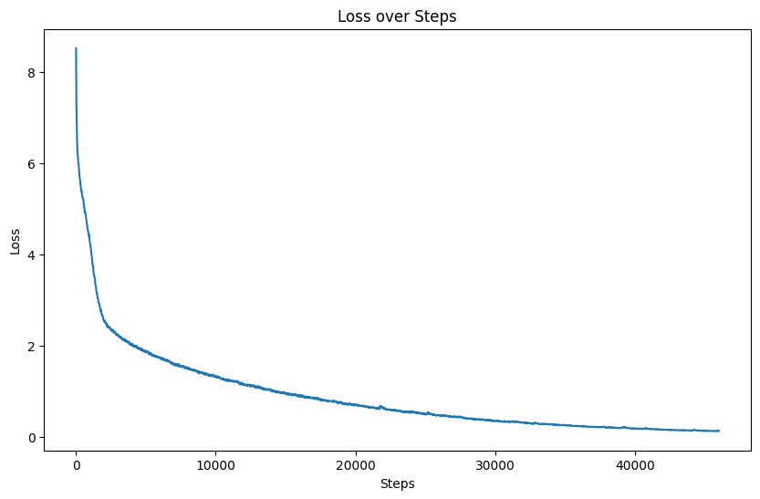
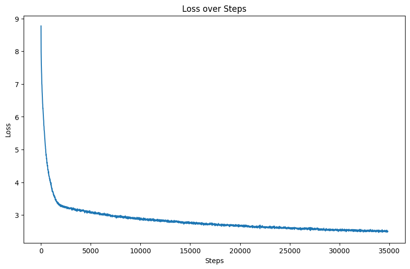

# 2. Pre-Train

参照[Qwen2](https://github.com/huggingface/transformers/blob/main/src/transformers/models/qwen2/modeling_qwen2.py)实现模型主要架构，参照[LLAMA](https://github.com/huggingface/transformers/blob/main/src/transformers/models/llama/modeling_llama.py)实现Eager GQA，参照[Qwen2](https://github.com/huggingface/transformers/blob/main/src/transformers/models/qwen2/modeling_qwen2.py)实现SDPA，参照[十分钟读懂旋转编码（RoPE）](https://zhuanlan.zhihu.com/p/647109286)实现旋转位置编码。

**使用数据:**

**数据处理:**

- 核心步骤（试了一下预处理速度太慢，目前训练速度也太慢了，所以先做模型结构去了）：

    1. 计算文本hash值，对重复部分进行再hash
    2. 对再hash重复部分检查其是否相同，相同则删除
    3. 对超长部分文本进行分段

- 参考： [1-pretrain.ipynb](../notebooks/1-pretrain.ipynb)

## **2.2 NOTES:**

### [2025.2.15]

**①** 基础实验已跑通，6卡训练耗时约41小时，Loss如图：

  

**②** Debug Qwen2模型推理过程，对模型文件进行修改，增加对SDPA的支持

1. 关注GenerationMixin做的n件事
   1. 生成position_ids和cache_position等
      - position_ids：在GenerationMixin.prepare_inputs_for_generation里被生成，由attention_mask前向累加得到，并在模型计算rotary_embedding时使用
      - cache_position：在GenerationMixin._get_initial_cache_position里被生成，并被past_key_values_length截断，在模型生成causal_mask和记录静态Cache时被使用

   2. 初始化Cache实例

      - 检查是否有传入的Cache实例
      - 检查模型支持的Cache类型
      - 没有支持类型时检查是否支持动态Cache类型

   3. 将准备好的参数传入生成方法，由生成方法调用模型的`forward`方法

      `GenerationMixin`集成了多种采样方法，如`GreedySearch`，`BeamSearch`以及`Sample`等；

2. Flash Attention

   - 参考资料

    [Bilibili: Flash Attention 为什么那么快？原理讲解](https://www.bilibili.com/video/BV1UT421k7rA)

    [Bilibili: 【7】Flash Attention 原理讲解](https://www.bilibili.com/video/BV17CPkeEEHH)

   - 训练日志（基于SDPA实现）

    在Loss计算时，如果忽略掉`attention_mask`中的`padding`部分的值，则会造成训练过程的极不稳定，以及收敛困难

### [2025.3.2]

1. SDPA实现的预训练结果

模型的预训练结果似乎没有Eager实现的效果好，得找找原因，测试模型加入一下计划，目前怀疑是没有使用warmup学习率调度的原因，OneCycle可能会在训练初期由于学习率过高使得模型进入局部最优

2. Cache

  PyTorch 支持的Cache类型有好几种，比较常用的是DynamicCache和StaticCache。DynamicCache在非编译情况下使用，不限制缓存大小。StaticCache固定缓存大小，主要与compile配合使用。
  Cache主要用在推理的non-prefilling阶段。在prefilling阶段，模型会计算n query长度和m key长度的attention结果，然后更新到Cache中，这里的时间复杂度是O(n*m)，然后在推理的Non-Prefilling阶段，每次的query长度为1，时间复杂度下降为O(m)

3. Forward MoE

  总感觉FFN MoE的按照词的粒度来分配专家有点怪

  Deepspeed文档里有个[`deepspeed.moe.layer.MoE`](https://deepspeed.readthedocs.io/en/latest/moe.html)，有空看看什么回事
